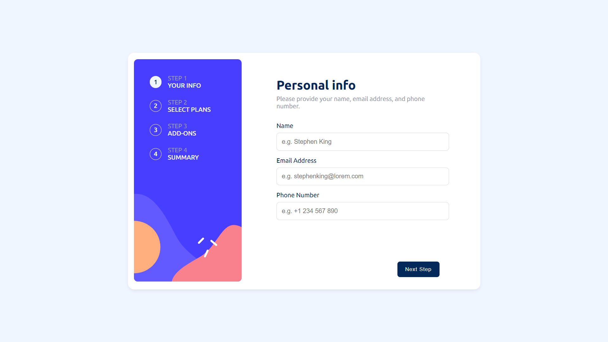

## Welcome! 👋

# Frontend Mentor - Multi step form

This is a solution to the [Multi step form on Frontend Mentor](https://www.frontendmentor.io/challenges/multistep-form-YVAnSdqQBJ). Frontend Mentor challenges help you improve your coding skills by building realistic projects.

## Table of contents

- [Overview](#overview)
  - [Screenshot](#screenshot)
  - [Links](#links)
- [My process](#my-process)
  - [Built with](#built-with)
  - [What I learned](#what-i-learned)
- [Author](#author)
- [Acknowledgments](#acknowledgments)

## Overview

### The challenge

Users should be able to:

- View the optimal layout for the app depending on their device's screen size
- See hover states for all interactive elements on the page
- Price change button purely build with CSS
- In total section the services are dynamically comming from stack.

### Screenshot

### Links

- Solution URL: [Visit](https://www.frontendmentor.io/challenges/multistep-form-YVAnSdqQBJ)
- Live Site URL: [Visit](https://akibraza91.github.io/multi-step-form/)

## My process

### Built with

- Semantic HTML5 markup
- CSS
- Flexbox
- Mobile-first workflow
- JavaScript

## Author

- Frontend Mentor - [@akibraza91](https://www.frontendmentor.io/profile/akibraza91)
